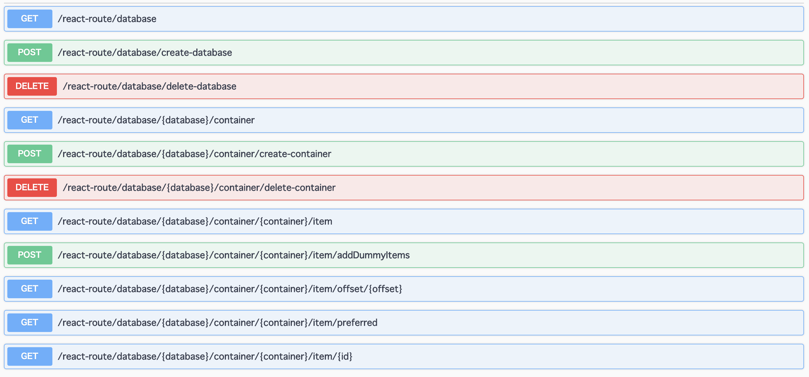

# Reactive CosmosDB On Quarkus
In this project, I created a sample Cosmos DB Application with Asynchronous and Non-Blocking operation by using Project Reactor and Mutiny for Reactive Operation. And this sample application is created running on Quarkus.

## Used Technologies

***Reactive Programing Libraries for Java***

* [Project Reactor](https://projectreactor.io/)
* [SmallRye Mutiny](https://smallrye.io/smallrye-mutiny/)

***Runtime***

* [Quarkus](https://quarkus.io/guides/)
* [Quarkus REACTIVE ROUTES by Vert.x](https://quarkus.io/guides/reactive-routes)

***Cosmos DB***

* [Azure Cosmos DB](https://azure.microsoft.com/services/cosmos-db/?WT.mc_id=java-twitter-yoterada)
* [Azure CosmosDB Client Library for Java](https://azuresdkdocs.blob.core.windows.net/$web/java/azure-cosmos/4.7.0/index.html)

***Others***

* [JSON-B](http://json-b.net/)
* [Cosmos DB Change Notified to Azure Logic App -> Twitter](https://docs.microsoft.com/azure/logic-apps/?WT.mc_id=java-twitter-yoterada)
* .....

## Interface

