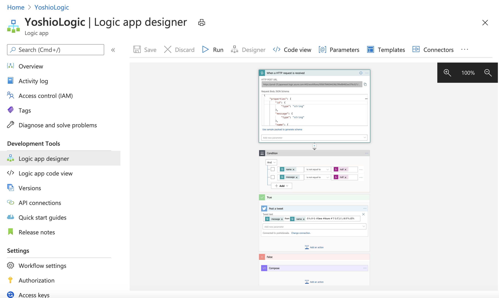
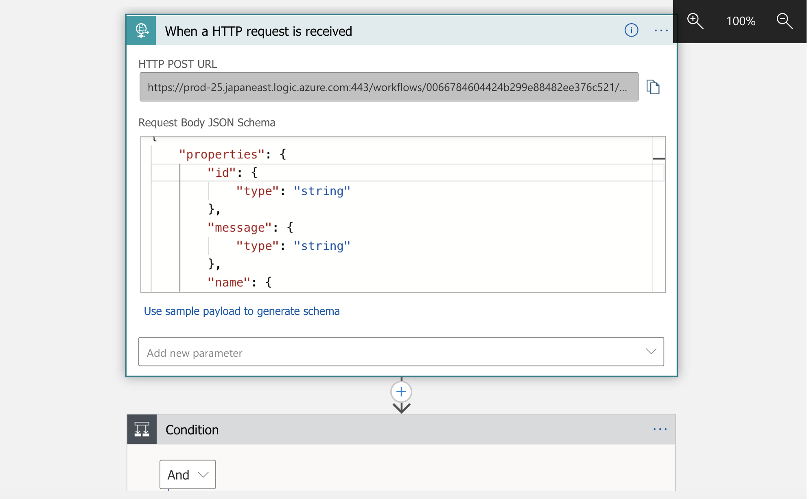
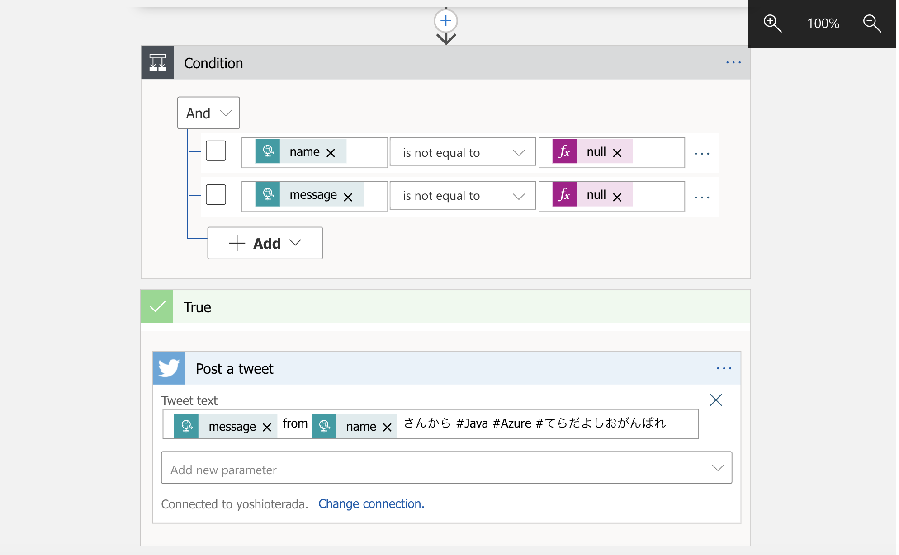
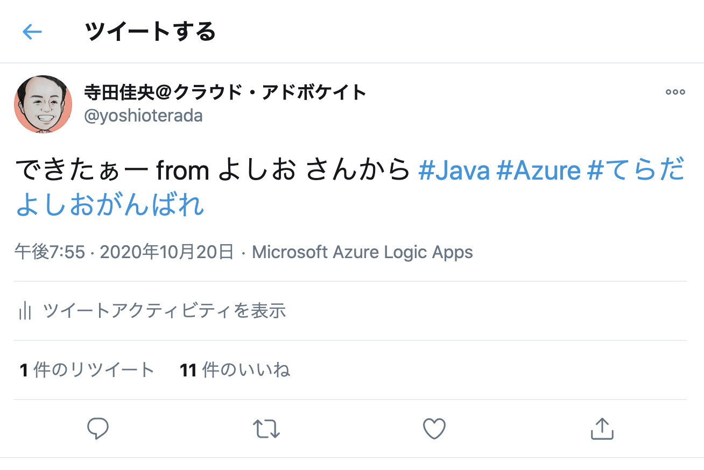

# Reactive CosmosDB On Quarkus
In this project, I created a sample Cosmos DB Application with Asynchronous and Non-Blocking operation by using Project Reactor and Mutiny for Reactive Operation. And this sample application is created running on Quarkus.

## Used Technologies

***Reactive Programing Libraries for Java***

* [Project Reactor](https://projectreactor.io/)
* [SmallRye Mutiny](https://smallrye.io/smallrye-mutiny/)

***Runtime***

* [Quarkus](https://quarkus.io/guides/)
* [Quarkus REACTIVE ROUTES by Vert.x](https://quarkus.io/guides/reactive-routes)

***Cosmos DB***

* [Azure Cosmos DB](https://azure.microsoft.com/services/cosmos-db/?WT.mc_id=java-0000-yoterada)
* [Azure CosmosDB Client Library for Java](https://azuresdkdocs.blob.core.windows.net/$web/java/azure-cosmos/4.7.0/index.html)

***Others***

* [JSON-B](http://json-b.net/)
* [Cosmos DB Change Notified to Azure Logic App -> Twitter](https://docs.microsoft.com/azure/logic-apps/?WT.mc_id=java-0000-yoterada)
* .....

## Interface


### Executions Samples

#### Create DB

```bash
curl -X POST -H 'Content-Type:application/json' \
 localhost:8080/react-route/database/create-database \
 -d '{"dbName":"PERSON_DB"}'
```

#### Delete DB

```bash
curl -X DELETE -H 'Content-Type:application/json' \
 localhost:8080/react-route//database/delete-database \
 '-d {"dbName":"PERSON_DB"}'
```

#### List DB

```bash
curl -X GET http://localhost:8080/react-route/database
```

#### Create Container

```bash
curl -X POST -H 'Content-Type:application/json' \
  http://localhost:8080/react-route/database/PERSON_DB/container/create-container \
  -d '{"containerName": "personmanage", "partitionName":"/lastName","requestUnit": 1000}'
```

#### Delete Container

```bash
curl -X DELETE -H 'Content-Type:application/json'
 localhost:8080/react-route/database/PERSON_DB/container/delete-container -d
 '{"containerName": "personmanage"}'
```

#### List Containers

```bash
curl -X GET http://localhost:8080/react-route/database/PERSON_DB/container
```

#### Query Sample


```bash
curl -X GET http://localhost:8080/react-route/database/PERSON_DB/container/personmanage/item
```

```bash
curl -X GET http://localhost:8080/react-route/database/PERSON_DB/container/personmanage/item/offset/3
```

```bash
curl -X GET http://localhost:8080/react-route/database/PERSON_DB/container/personmanage/item/preferred
```

```bash
curl -X GET http://localhost:8080/react-route/database/PERSON_DB/container/personmanage/item/$ID
```

#### Create Item

```bash
curl -X POST -H 'Content-Type:application/json' \
 http://localhost:8080/react-route/database/PERSON_DB/container/personmanage/item/addItem \
 -d '{"firstName": "a", "lastName": "b","age": 39}'
```

```bash
 curl -X POST "http://localhost:8080/react-route/database/PERSON_DB/container/personmanage/item/addDummyItems"\ 
   -H "accept: application/json" \
   -H "Content-Type: application/json"
```


## Notify to Twitter via Azure Logic App from Cosmos DB Change Feed

If Cosmos DB Change Feed receive the chage event, I invoked Azure Logic App.
And in the Azure Logic App, I send the changed document to Twitter.





